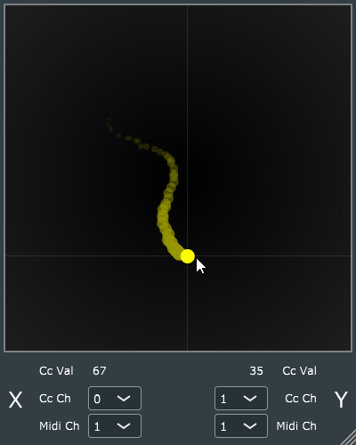

# Welcome to MidiPad! :)

* MidiPad is a free open-source VST3 / AU plugin built for Windows & Mac (see Releases).
* Turn your trackpad or mouse into an expressive Midi CC controller, just by hovering over MidiPad. No click & drag required.

### Download
* Download latest release here: https://github.com/whoadrian/MidiPad/releases/tag/v0.2.0
* Buy me a coffee! https://www.buymeacoffee.com/whoadrian

### MidiPad Instructions:
* Hover your mouse over MidiPad and it will send Midi CC messages for the X and Y axes. 
* You can select the CC Channel, as well as the Midi Channel per axis.
* Clicking on the Pad area will Lock/Unlock the cursor.

### Notes:

* Tested on Windows 11 & MacOS M1
* Ableton has a weird relationship with MIDI-only plugins.
A nice way of working with MidiPad in Ableton is to add it to its own MIDI track.
In your other tracks with synths, select as MIDI Input, MidiPad from its respective track.
* Built with JUCE/C++, open-source. Can open this folder as a project in your CMake-compatible IDE and build it yourself :)
